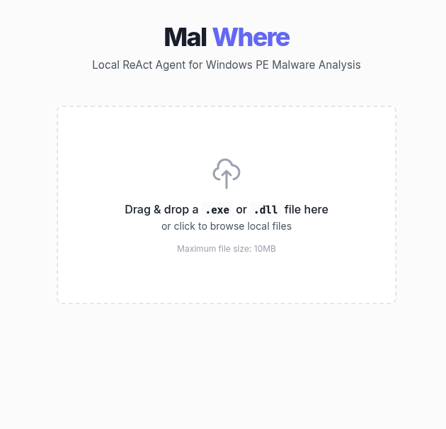
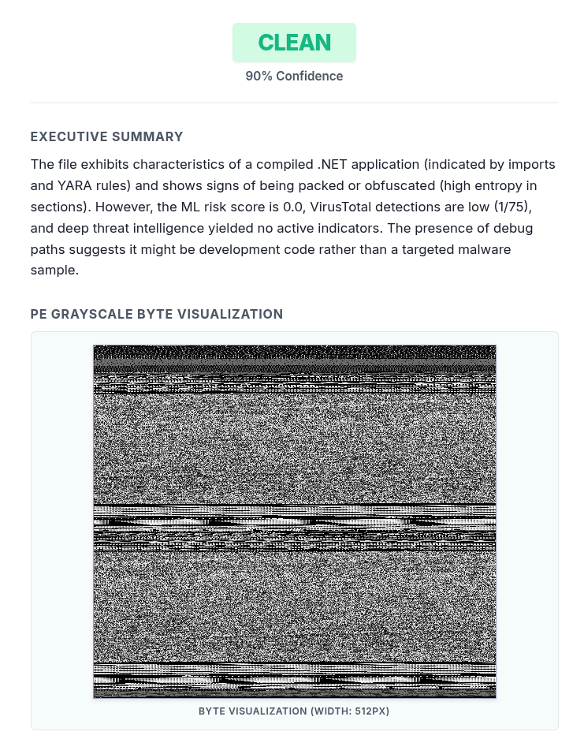
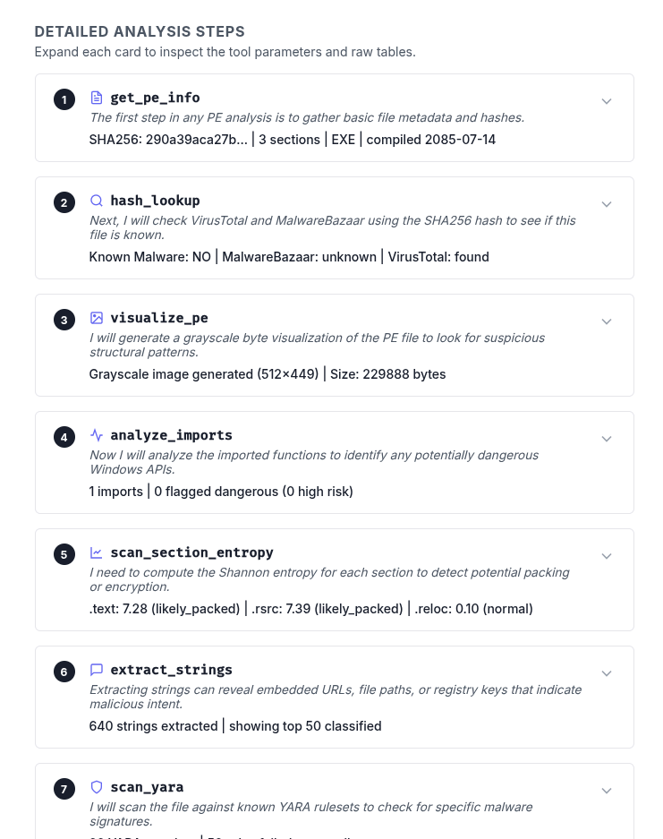
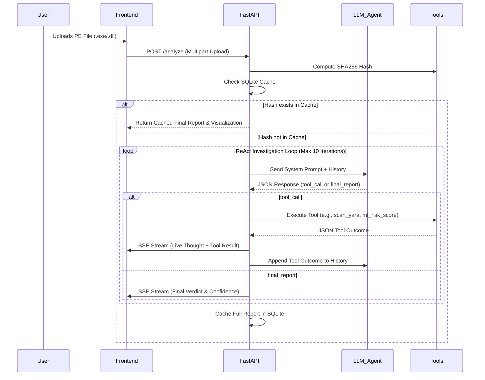
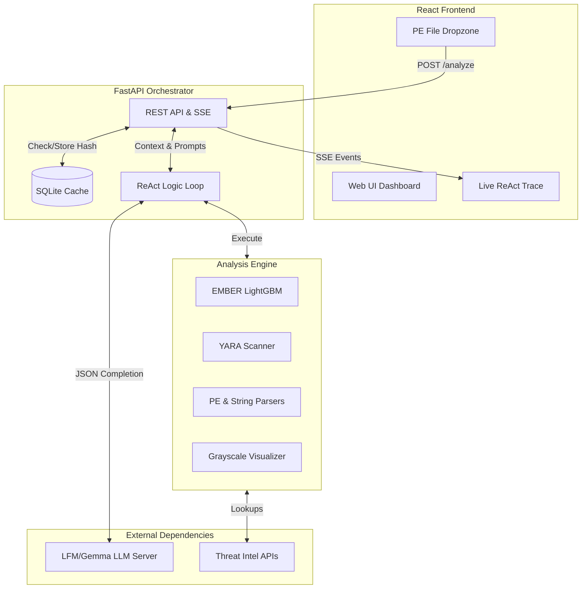

# MalWhere 🔬

MalWhere is a local, agent-driven Windows PE malware analysis pipeline and visualization platform. It uses a **ReAct (Reasoning and Action) loop** powered by a local or remote Large Language Model to dynamically investigate uploaded PE binaries, invoke static/dynamic analysis tools, perform threat intelligence lookups, and compile a structured threat report.

An interactive React frontend visualizes the agent's step-by-step reasoning trace in real time as the backend processes the file.

---

## ✨ Key Features

- **Dynamic Agent Orchestration**: Uses a ReAct loop to iteratively analyze binaries. The agent decides what tools to call based on the output of previous steps, rather than following a rigid linear pipeline.
- **EMBER Machine Learning Classifier**: Fully integrated pre-trained EMBER LightGBM model for feature-based ML classification. Disables heuristic fallbacks to ensure precise, state-of-the-art inference.
- **YARA Signature Auditing**: Performs automated recursive signature scanning against a downloaded community ruleset, automatically handling syntax variations and rule compilation flags.
- **Binary Grayscale Visualizer**: Maps the raw byte density of the PE binary to a 512px width grayscale PNG to visually identify packers, resource sections, or code patterns.
- **Threat Intelligence Feeds**: Integrated live lookups via:
  - **VirusTotal** (using detection ratio thresholds to avoid false positives)
  - **MalwareBazaar**
  - **ThreatFox**
  - **AlienVault OTX**
- **SQLite Database Cache**: Speeds up analysis and saves API/LLM tokens by caching completed reports, steps, and binary visualizer images indexed by file hashes.
- **SSE Real-time Streaming**: Streams agent steps, thoughts, tool outcomes, and the final report to the frontend via Server-Sent Events (SSE).

---

## 📸 User Interface

Here is the glassmorphic React dashboard displaying the analysis pipeline in action:

| 1. File Upload Dropzone (Idle) | 2. Analysis Complete Verdict |
| :---: | :---: |
|  |  |

| 3. Step-by-Step Live Agent Trace |
| :---: |
|  |

---

## 🔄 Agent Workflow

The core of MalWhere is a **ReAct (Reasoning and Action)** loop. Instead of executing a static sequence of analysis scripts, MalWhere passes control to a Large Language Model (LLM) equipped with a suite of analytical tools. The agent dynamically decides what to investigate based on the ongoing findings.



### Typical Investigation Sequence:
1. **Initial Metadata Extraction**: The agent always starts by calling `get_pe_info` to retrieve the file hashes, sections, and compilation timestamps.
2. **Threat Intelligence Triaging**: The agent calls `hash_lookup` with the SHA256 hash. If it receives a significant number of detections from VirusTotal or MalwareBazaar, it immediately pivots to `threat_intel_lookup` to pull AlienVault OTX/ThreatFox campaign details.
3. **Deep Static Analysis**: The agent calls `visualize_pe` to construct the binary visualization. It then sequentially executes a battery of static tools (`analyze_imports`, `scan_section_entropy`, `extract_strings`, `scan_yara`) to uncover embedded IOCs, packed sections, or malicious capabilities.
4. **Machine Learning Verification**: The agent runs the binary through the `ml_risk_score` tool, utilizing the pre-trained EMBER LightGBM model to acquire an empirical probability score of maliciousness.
5. **Synthesis**: The agent aggregates all the gathered evidence, formulates a conclusive summary, and issues the `final_report`.

---

## 🏗️ Architecture



### Directory Layout
```
MalWhere/
├── agent/             # LLM ReAct orchestrator and prompt templates
├── tools/             # Pure Python analysis tools (lief, yara, EMBER, etc.)
├── api/               # FastAPI orchestrator server
├── frontend/          # Vite-based React interface
├── tests/             # Comprehensive modular unit tests
└── rules/             # YARA rules folder
```

---

## 🚀 Setup & Installation

### 1. Prerequisites
- **Python**: Python 3.10+ (recommend using `uv` for fast package management)
- **Node.js**: Node 18+ (for frontend dashboard)

### 2. Configure Environment Variables
Create a `.env` file in the project root:
```env
# LLM Model Configuration
LLM_BASE_URL="https://YOUR_ZROK_OR_LOCAL_URL/v1"
LLM_MODEL="gemma-4-e4b"
LLM_API_KEY="sk-no-key"

# Threat Intelligence API Keys
MALWAREBAZAAR_API_KEY="your_key"
THREATFOX_API_KEY="your_key"
VIRUSTOTAL_API_KEY="your_key"
OTX_API_KEY="your_key"
```

### 3. Install Python Dependencies
```bash
uv pip install -e .
```
*(Or standard `pip install -r requirements.txt` if not using `uv`)*

### 4. Fetch EMBER Model Weights
Download the pre-trained EMBER LightGBM model file and place it in the `models/` directory:
```bash
mkdir -p models
# Download and place ember_model.txt into models/
```

### 5. Fetch Community YARA Rules
Clone the community YARA ruleset into the `rules/` directory:
```bash
git clone --depth 1 https://github.com/Yara-Rules/rules.git rules/yara-rules
```

---

## ⚙️ Running the Application

### Start the FastAPI Backend
```bash
uv run uvicorn api.main:app --reload --port 8000
```

### Start the React Frontend
```bash
cd frontend
npm install
npm run dev
```
Open `http://localhost:5173` in your browser to upload binaries and view the live ReAct timeline.

---

## 🧪 Testing

Run the entire suite of static tools, database cache, and threat intelligence mocks using the test runner:
```bash
uv run python tests/run_all_tests.py
```

---

## ⚠️ Security Warning

**Live malware analysis risk** — Parsing untrusted PE files or compiling arbitrary YARA rules can expose the host to zero-day buffer overflows or target exploits. For production environments, run the backend inside a sandboxed Docker container or virtual machine with no access to the host network or sensitive host filesystem paths.
